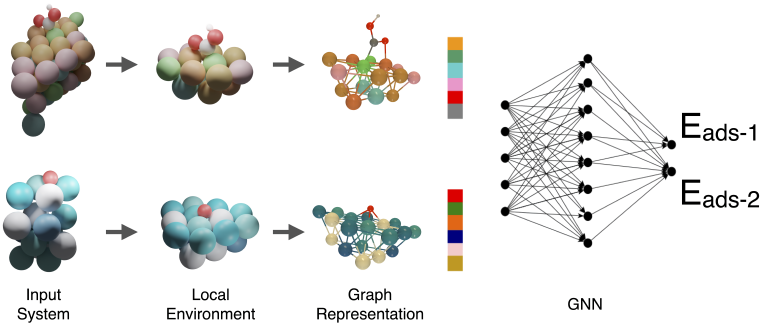
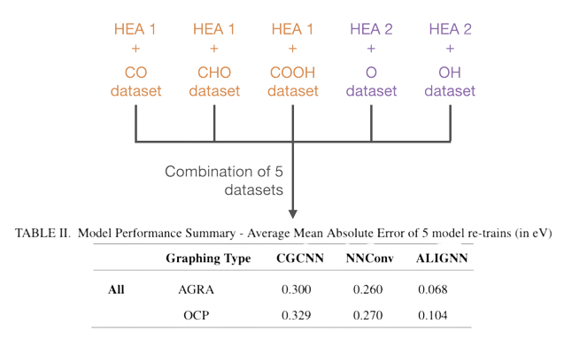

Automatic Graph Representation Algorithm
========================================

This repository provides code for a data processing algorithm to extract geometric structures from SQL dbs (ASE dbs), convert them into torch geometric graph objects, and train on a range of Graph Neural Networks (visualized below). The graph representation algorithm is then compared against the open catalyst project (OCPs) graph generation class AtomsToGraph. Our algorithm is observed to improve performance at a large reduction in computational cost thanks to a different approach to edge generation, feature embedding and node classification. The full work can be found in APL Machine Learning free of charge (https://doi.org/10.1063/5.0140487).

     

Table of Contents
=================

<!--ts-->
   * [Advancements in technology](#advancements-in-Technology)
   * [Performance improvements](#performance-improvements)
      * [Memory efficiency](#memory-efficiency)
      * [Accuracy and extrapolation](#accuracy-and-extrapolation)
   * [File structures](#file-structures)
      * [File contents](#file-contents)
      * [Package dependencies](#package-dependencies)
<!--te-->

Advancements in technology
==========================

Our Framework offers automated surface analysis functionality that works on every standard adsorption site (samples visualized below). The framework then extracts the neighbors based on the adsorption site type and generates edges in a bottum up, directed approach that differs from proximity cutoff methods.

     

Performance improvements
========================
Memory efficiency
-----------------
On sample databases of high entropy alloys for the CO2RR and OER,<strong> our framework had a 900% reduction in computational cost</strong>  without sacrificing accuracy as seen below.

| OCP Memory Used | AGRA Memory Used | 
|:---------------:|:---------------:|
| 410 MB  | 45 MB   | 
| 410 kB/datapoint   | 45 kB/datapoint   | 

Accuracy and extrapolation
--------------------------

On a combination of datasets, the AGRA also outperformed OCP on 3 common GNNs:

     

File structures
===============
File contents
-------------

This repository employs 1 notebook, 3 supplementary .py files, sample data/JSON files for feature engineering and a conda yml file for a functioning environment:

<strong>AGRA_algorithms.py </strong> - contains our (AGRA) ASE_To_Graph class, the open catalyst project (OCP) Atom_To_Graph class (solely for comparison), and extra functions to handle imported databases and data operations. 

<strong>GNN_architectures.py</strong> - contain GNNs architectures and a model handler class for easy operation of the models.

<strong>help_functions.py</strong> - basic data transformation functions to clean up the code in GNN_architectures.

<strong>sample_dataset folder</strong> - sample pickle files AGRA will generate.

<strong>element folder</strong> - JSON files containing cgcnn92 and megnet 16 feature embeddings.

<strong>AGRA_env.yml</strong> - If you're using conda, this file can be used to setup a functioning environment.

We chose to modularize the code this way so that researchers and programmers do not need to search a 1500+ line .py file for specifics.

Package dependencies
--------------------
- NumPy
- Pandas
- Matplotlib
- Seaborn
- TensorFlow/Keras
- Atomic Simulation Environment (ASE)
- Sklearn
