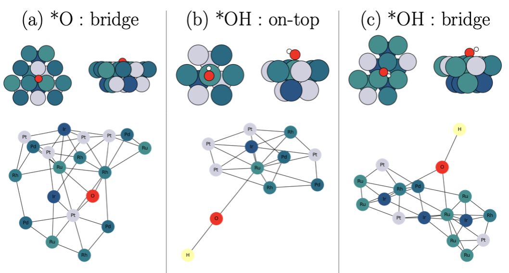
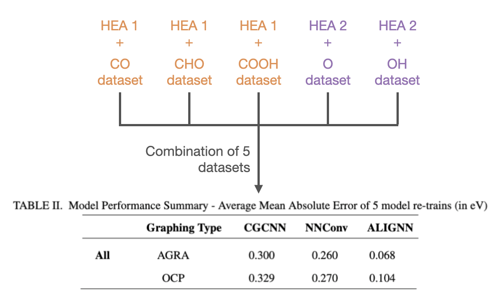

# Automatic-Graph-Representation-Algorithm-AGRA-
This repository provides code for a data Processing algorithm to extract geometric structures from SQL dbs (ASE dbs), convert them into torch geometric graph objects, and train on a range of Graph Neural Networks (visualized below). The graph representation algorithm is then compared against the open catalyst project (OCPs) graph generation class AtomsToGraph. Our algorithm is observed to improve performance at a large reduction in computational cost thanks to a different approach to edge generation, feature embedding and node classification. The full work can be found in APL Machine Learning free of charge (https://doi.org/10.1063/5.0140487).

     

Our Framework offers automated surface analysis functionality that works on every standard adsorption site (samples visualized below). The framework then extracts the neighbors based on the adsorption site type and generates edges in a bottum up, directed approach that differs from proximity cutoff methods.

     

On sample databases of high entropy alloys for the CO2RR and OER,<strong> our framework had a 900% reduction in computational cost</strong>  without sacrificing accuracy as seen below.

| OCP Memory Used | AGRA Memory Used | 
|:---------------:|:---------------:|
| 410 MB  | 45 MB   | 
| 410 kB/datapoint   | 45 kB/datapoint   | 
 
On a combination of datasets, the AGRA also outperformed OCP on 3 common GNNs:

     

